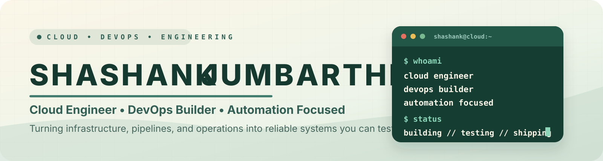

  
  
  
  

# Hello, I'm Shashank Jumbarthi

I'm an **IT and Cloud Engineer** interested in the connective tissue between **cloud infrastructure, DevOps automation, production operations, and security**.

I like projects where infrastructure does more than exist on paper: it should be **implemented, tested, observable, repeatable, and backed by evidence**.

## What I'm focused on

- Building **AegisOps**, a DevOps, cloud, and security operations platform for infrastructure, deployment, asset, vulnerability, alert, incident, and security-event visibility.
- Designing **KubeForge**, a Kubernetes cluster qualification framework for provisioning, validating, reporting on, and destroying ephemeral clusters before production deployment.
- Strengthening cloud environments with **AWS, Azure, Terraform, CI/CD, Docker, Kubernetes, monitoring, IAM, and automation**.
- Growing deeper into **platform engineering, DevSecOps, cloud reliability, infrastructure automation, and security operations**.

## Featured work

Project | What it demonstrates | Stack
--- | --- | ---
[AegisOps](https://github.com/shashank-jumbarthi/AegisOps) | DevOps, cloud, and security operations platform that centralizes infrastructure, deployments, assets, vulnerabilities, alerts, incidents, and security events. | Python · FastAPI · React · PostgreSQL · Docker · GitHub Actions · AWS · Nmap · MITRE ATT&CK
KubeForge | Kubernetes cluster qualification and reliability framework for provisioning, validating, reporting on, and destroying ephemeral clusters before production deployment. | Kubernetes · AWS EKS · Terraform · Python · GitHub Actions · Docker · Helm · Prometheus
[Portfolio](https://github.com/shashank-jumbarthi/portfolio) · [Live site](https://shashank-jumbarthi.github.io/portfolio/) | DeveloperFolio-style portfolio aligned with my cloud, DevOps, and infrastructure background. | HTML · CSS · GitHub Pages
[TitanFabric](https://github.com/shashank-jumbarthi/TitanFabric) | Python-based project work and infrastructure experimentation. | Python

## Experience snapshot

When | Where | Focus
--- | --- | ---
2026 - Present | Datara Inc · Software Engineer / Cloud Engineer | Windows and Linux systems, AWS infrastructure, IAM, CI/CD, Terraform, CloudFormation, Ansible, monitoring, documentation, and production support.
2021 - 2023 | Smart & Creative Solutions Group · Software Engineer / Cloud Engineer | Enterprise infrastructure support, AWS operations, automation scripts, CI/CD workflows, patching, access management, and operational runbooks.
2016 - 2019 | EditPoint (OPC) Pvt. Ltd. · Desktop Support Technician | Tier 1/Tier 2 support, Active Directory, Microsoft 365, ServiceNow, Windows workstations, asset tracking, and SLA-driven end-user support.

## Toolkit

  
  
  
  
  
  
  
  
  
  

`AWS` · `Azure` · `Terraform` · `CloudFormation` · `Ansible` · `Docker` · `Kubernetes` · `Jenkins` · `GitHub Actions` · `Python` · `PowerShell` · `Bash` · `Linux` · `Active Directory` · `Microsoft Entra ID` · `CloudWatch` · `Prometheus` · `Grafana` · `ELK Stack` · `Nmap`

---

  I'm always glad to connect about DevOps, cloud engineering, platform automation, infrastructure reliability, and security operations.

